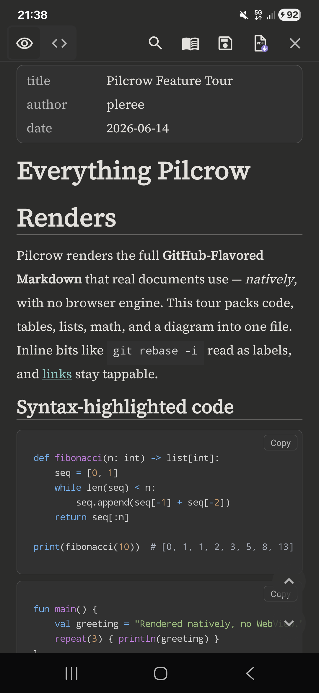
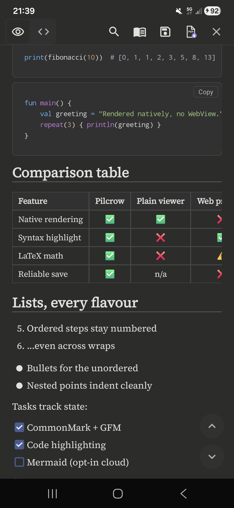
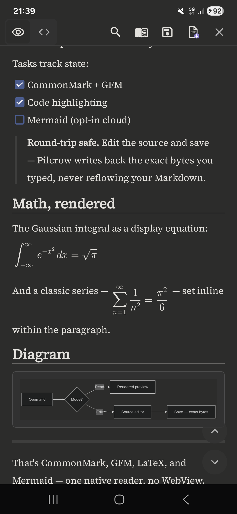
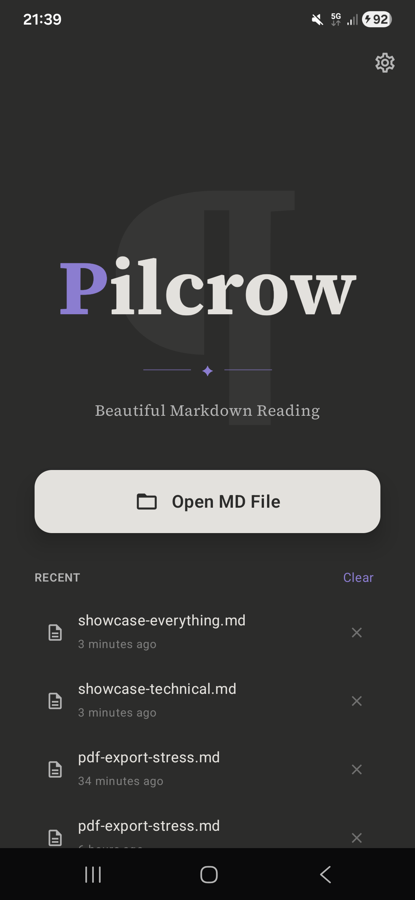
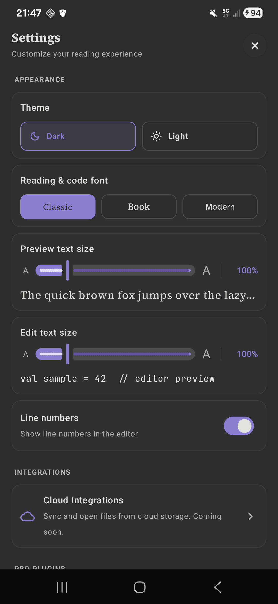

<div align="center">

# Pilcrow

**A beautiful, reliable, private Markdown reader for Android.**

[](https://play.google.com/store/apps/details?id=com.pilcrowmd)

[](https://github.com/pilcrowmd/pilcrow/actions/workflows/ci.yml)
[](LICENSE)
[](#build--run)
[](#tech-stack)
[](#tech-stack)



</div>

---

## What & why

The web is full of Markdown — LLM answers, READMEs, notes, technical docs — and most Android apps
render it in a WebView wrapped in ads and trackers. Pilcrow takes the opposite approach.

Pilcrow renders Markdown **natively** — no WebView, no JavaScript runtime, no network calls to read
your files. The result is fast, typographically careful rendering of full GitHub-Flavored Markdown
(tables, code, math, task lists, frontmatter) with a reading experience that looks designed rather
than dumped.

- **Beautiful.** Serif body type, real syntax highlighting, rendered LaTeX, and a calm dark theme
  (with a warm-cream light theme) built from an exact design-token system.
- **Reliable.** Atomic saves that never truncate your file, round-trip fidelity that preserves
  your line endings and frontmatter (a file with mixed line endings is written back uniformly in
  its dominant style), and a renderer that degrades gracefully instead of crashing on syntax it
  doesn't support.
- **Private.** Files are read through Android's Storage Access Framework and stay on your device.
  No accounts, no analytics, no ads, no network in the reading path. Free software under the GPL.

## Features

- **Full GitHub-Flavored Markdown** — headings, emphasis, lists, task lists, blockquotes, tables,
  fenced code, thematic breaks, links and images.
- **Native syntax highlighting** for fenced code blocks, with a one-tap copy button.
- **LaTeX math** — inline (`$…$` or `$$…$$`) and block `$$…$$`, rendered as crisp native bitmaps
  (no WebView). Single-`$` parsing is currency-aware, so `$5 and $10` stays plain text.
- **Reader + source editor** — toggle between a polished reader and a real code editor with
  Markdown highlighting, a line-number gutter, and soft wrap.
- **In-document search** with match highlighting and next/previous navigation.
- **Table of contents** drawer generated from your headings, with tap-to-jump.
- **YAML frontmatter** rendered as a tidy metadata card.
- **Export to PDF** — paginated, print-styled, matching what you see on screen.
- **Two themes** — a default dark theme and a warm-cream light theme.
- **Per-file memory** — reopens your last file at the position you left it; keeps a recents list.
- **Adjustable type** — independent font scaling for reader and editor.
- **Graceful by design** — diagrams and unsupported syntax degrade to readable code blocks rather
  than breaking the page (Mermaid can optionally render via the cloud, off by default).
- **Offline & ad-free** — minimum Android 8.0, no required network permission for reading.

## Screenshots

<div align="center">

| Syntax-highlighted code & tables | Math & diagrams | Home & recents | Settings |
|:---:|:---:|:---:|:---:|
|  |  |  |  |

<sub>A warm-cream light theme is also built in — <a href="docs/screenshots/reader-hero-light.png">see the light reader</a>.</sub>

</div>

## Architecture overview

Pilcrow is a single-activity Jetpack Compose app following **Clean Architecture + MVVM** with
unidirectional data flow and strict layer boundaries:

- **UI (Compose)** is passive and state-driven — no business logic, colors only from design tokens.
- **State (`MarkdownViewModel`)** exposes UI state as `StateFlow` and orchestrates everything; it
  never does I/O or parsing directly.
- **Domain** holds pure-Kotlin parsing and search use cases — testable with no emulator.
- **Data** hides file I/O and persistence behind interfaces (`FileRepository` over the Storage
  Access Framework; `StorageManager` over Jetpack DataStore).

Dependencies are wired through a single hand-written composition root (a manual `AppContainer`), and
Markdown is rendered to native views with [Markwon](https://github.com/noties/Markwon) — **never a
WebView**. The four Essential Safeguards (no data loss, round-trip fidelity, crash-free rendering,
design-token fidelity) are enforced in code and protected by tests.

**→ Full details in [docs/ARCHITECTURE.md](docs/ARCHITECTURE.md).**

## Build & run

**Requirements:** JDK 21, Android SDK with API 36, and `minSdk` 26 (Android 8.0) for the target
device. The Gradle wrapper pins the build tooling — no global Gradle install needed.

```bash
git clone https://github.com/pilcrowmd/pilcrow.git
cd pilcrow

# Build the debug APK
./gradlew clean assembleDebug

# Install to a connected device / emulator
./gradlew installDebug
```

The debug APK is written to `app/build/outputs/apk/debug/`.

> **Build from `clean` for any result you intend to trust.** Pilcrow pins Kotlin to 2.3.10 to match
> the metadata version of its editor dependency (Sora `editor-bom:0.24.5`). That toolchain carries a
> known incremental-compiler quirk: it can cache a stale state and report phantom `Unresolved
> reference` errors on code that compiles cleanly from scratch — a false *negative* (green turned
> red), never a false pass. A from-scratch build is therefore the source of truth, and CI runs
> `clean` first so it never trusts a poisoned cache.

## Testing & quality

Quality is enforced on every push and pull request by [CI](.github/workflows/ci.yml), which runs the
full gate from a clean build:

```bash
./gradlew clean
./gradlew assembleDebug ktlintCheck detekt testDebugUnitTest verifyRoborazziDebug bundleRelease lintRelease --rerun-tasks
```

- **Unit tests** cover the critical paths, including the
  Essential Safeguards: crash-safe save with process-death recovery from a durable write-ahead log
  (`LocalFileRepositoryAtomicSaveTest`), LF/CRLF round-trip fidelity
  (`MarkdownViewModelLineEndingTest`), and large-file crash resistance
  (`MarkwonRendererLargeFileTest`, ~5,000 lines).
- **Visual-regression goldens** via [Roborazzi](https://github.com/takahirom/roborazzi) — every
  Markdown sample × 3 font scales × 2 themes, plus the Welcome, search, and GitHub-teaser screens,
  rendered under Robolectric and pinned to a fixed device config. Any layout or typography drift
  fails the build.
- **Static analysis & style** — [ktlint](https://github.com/JLLeitschuh/ktlint-gradle) and
  [detekt](https://github.com/detekt/detekt), both baselined and run in the gate.
- **License diligence** — all third-party dependencies and bundled fonts are tracked in
  [LICENSES.md](LICENSES.md) and surfaced in-app, and verified compatible with GPL-3.0-or-later as a
  combined work.

## Tech stack

| Area | Choice |
|---|---|
| Language | Kotlin 2.3 |
| UI | Jetpack Compose (Material 3) |
| Architecture | Clean Architecture + MVVM + UDF, manual DI |
| Async | Coroutines & Flow |
| Markdown rendering | [Markwon](https://github.com/noties/Markwon) (native, no WebView) |
| Syntax highlighting | [Prism4j](https://github.com/noties/Prism4j) |
| Math | JLatexMath (via Markwon) |
| Code editor | [Sora Editor](https://github.com/Rosemoe/sora-editor) |
| Persistence | Jetpack DataStore (Preferences) |
| File access | Storage Access Framework |
| Testing | JUnit, Robolectric, [Roborazzi](https://github.com/takahirom/roborazzi), MockK |
| Fonts | [Source Serif 4](https://github.com/adobe-fonts/source-serif) & [JetBrains Mono](https://github.com/JetBrains/JetBrainsMono) (OFL) |

## Roadmap

Pilcrow v1 is intentionally focused — read and edit Markdown beautifully and safely, offline.
Directions under consideration for future releases:

- Document collections / multi-file libraries.
- Additional export targets and richer print options.
- Optional offline diagram rendering.
- Wider syntax coverage (footnotes, definition lists).

Nothing here is a commitment; the v1 safeguards and native-only constraint always come first.

## Contributing

Bug reports, feature ideas, and feedback are very welcome — please open an issue. External code
contributions are on hold while we finalize our Contributor License Agreement (CLA); see
**[CONTRIBUTING.md](CONTRIBUTING.md)** for details and the workflow, and our
**[Code of Conduct](CODE_OF_CONDUCT.md)**. Security issues should follow
**[SECURITY.md](SECURITY.md)** rather than a public issue.

## License

Pilcrow is **free software**, licensed under the **GNU General Public License v3.0 or later
(GPL-3.0-or-later)**. Copyright © 2026 pleree.

It comes with **no warranty**. See [LICENSE](LICENSE) for the full text or
<https://www.gnu.org/licenses/>. The copyleft license is deliberate: it keeps Pilcrow and its
derivatives free and open, and prevents closed-source or ad-laden clones.

The app's own license is **distinct from** the licenses of its third-party dependencies and bundled
assets, which are documented in [LICENSES.md](LICENSES.md) and surfaced in-app under
**Settings → About → Open source licenses**.

## Acknowledgements

Pilcrow stands on excellent open-source work:

- [Markwon](https://github.com/noties/Markwon) and [Prism4j](https://github.com/noties/Prism4j) —
  native Markdown rendering and syntax highlighting.
- [Sora Editor](https://github.com/Rosemoe/sora-editor) — the native code editor.
- [JLatexMath](https://github.com/opencollab/jlatexmath) — math typesetting.
- [Roborazzi](https://github.com/takahirom/roborazzi) — screenshot testing.
- [Source Serif 4](https://github.com/adobe-fonts/source-serif) and
  [JetBrains Mono](https://github.com/JetBrains/JetBrainsMono) — the typefaces, under the SIL Open
  Font License.
