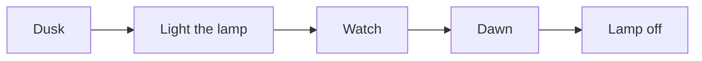

# PilcrowMD test pack – General

**What this is.** One file that touches almost everything PilcrowMD can show, so you can see in a
few minutes how it looks on your phone. Open it, read it top to bottom in reading mode, then tap
**Edit** and look at the same text as source.

**What to look for**

- The small card at the very top: that is the *front matter* (the lines between `---` at the start
  of the file). It should show as a tidy key/value card, not as raw text.
- Every section below should look finished: no stray `*`, `#` or `|` characters, nothing cut off at
  the right edge, nothing overlapping.
- Change **Settings → Theme** and **Preview text size**, then come back. Everything should still
  fit and stay readable.
- Open the headings drawer: every heading in this file should be listed, in order.
- Search for the word *lighthouse*. It appears three times: in this line, in section 4 and in section 8.
- The very last line of the file says **End of the General pack**. If you can read it, nothing
  was lost on the way.

**Known gaps in version 1.0.12** – we know about these, no need to report them:

- Bold, italic, links and formulas inside a table cell show as plain text; a formula in a cell
  shows as an empty space.
- A web address written without angle brackets (`https://…`) is not a link; `<https://…>` is.
- The headings drawer lists the front-matter lines as if they were headings.
- Text in reading mode cannot be selected; switch to Edit to copy.
- Task boxes cannot be ticked in reading mode (by design: reading mode never changes your file).
- Diagrams (Mermaid) are drawn only if you turn on the online **Mermaid Diagrams** setting;
  otherwise they show as code.
- An HTML `<table>` runs its cells together on one line.

Found something not on this list? Please open an issue at
<https://github.com/pilcrowmd/pilcrow/issues> and say which pack and which section.

---

## 1. Headings

# Heading level 1
## Heading level 2
### Heading level 3
#### Heading level 4
##### Heading level 5
###### Heading level 6

An underlined heading
=====================

A smaller underlined heading
----------------------------

## 2. Text styles

Plain text, *italic*, **bold**, ***bold italic***, ~~struck out~~, and `inline code`.
Underscores work too: _italic_ and __bold__. A word_with_underscores stays one word.

A line that ends with two spaces  
continues on the next line. A line that ends with a backslash\
does the same. A plain line break
just joins the lines into one paragraph.

Escaped characters stay literal: \*not italic\*, \# not a heading, \[not a link\].

## 3. Lists

- A bullet
- Another bullet
  - A nested bullet
    - Nested once more
- Back to the top level

1. First step
2. Second step
   1. A sub-step
   2. Another sub-step
3. Third step

7. A list that starts at seven
8. and carries on at eight

- [x] A finished task
- [ ] A task still to do
  - [x] A finished sub-task

## 4. Quotes and callouts

> A plain quote. The keeper of the lighthouse wrote everything down before deciding what it meant.
>
> > A quote inside a quote.

> [!NOTE]
> A note: useful background.

> [!TIP]
> A tip: a better way to do something.

> [!IMPORTANT]
> Important: do not skip this.

> [!WARNING]
> Warning: something could go wrong.

> [!CAUTION]
> Caution: this could cause damage.

## 5. A table

| Item         | Left    | Centre | Right |
| :----------- | :------ | :----: | ----: |
| Lantern      | brass   |   ✓    |  12.5 |
| Logbook      | paper   |   ✓    |   3.0 |
| Spare wick   | cotton  |        |   0.4 |
| Foghorn      | steel   |   ✓    | 140.0 |

## 6. Code

```kotlin
fun beam(degrees: Int): String =
    if (degrees % 360 == 0) "full turn" else "$degrees°"
```

```json
{ "tower": "North Point", "range_km": 33, "lit": true }
```

A long line in a code block either scrolls sideways or wraps, depending on
**Settings → Wrap long lines in code blocks**:

```text
2026-10-02 06:00:00 lamp=on rotation=10s range_km=33 fog=false visibility_km=18 operator_note="calm sea, light wind from the west, all lenses clean"
```

## 7. Maths

Inline: the area of a circle is $A = \pi r^2$, and $e^{i\pi} + 1 = 0$.

Display:

$$
\sum_{k=1}^{n} k = \frac{n(n+1)}{2}
$$

## 8. Footnotes

The lighthouse lamp turns once every ten seconds.[^turn] Its light reaches about thirty kilometres on a clear
night.[^range]

[^turn]: Tap the small number to jump here, and the arrow to jump back.
[^range]: The distance depends on the height of the tower and the weather.

## 9. A collapsible section

<details>
<summary>Tap to open: the keeper's checklist</summary>

1. Wind the clockwork.
2. Trim the wick.
3. Polish the lens.

</details>

## 10. Links and a picture

An ordinary link: [PilcrowMD website](https://pilcrowmd.com).
An angle-bracket link: <https://example.org/>. An email address: <hello@example.org>.


The picture above is on the web, so it shows as a placeholder box: PilcrowMD never downloads
pictures. A picture stored with your note, or embedded in it, does show.

## 11. A diagram



## 12. Many languages and symbols

Polski: zażółć gęślą jaźń. Français : où est la gare ? Deutsch: Größe, Straße. Ελληνικά: φάρος.
Русский: маяк. 日本語: 灯台. 中文: 灯塔. 한국어: 등대. हिन्दी: प्रकाशस्तंभ.

Right to left: العربية: منارة — עברית: מגדלור — mixed with numbers 12.5 km.

Emoji: 🌊 🗼 🌙 ⭐ 👩‍🚀 👨‍👩‍👧. Symbols: ± ≤ ≥ ≠ ∞ → ° µ Ω ‰ “quotes” ‘single’ — dash – dash … ellipsis.

## 13. Tricky input

None of the lines below should break the rest of the page.

<div>A tag that is never closed.

<b><i>Tags closed in the wrong order</b></i>

A link with no end: [half a link](https://example.org

`code that never closes

- Level 1
  - Level 2
    - Level 3
      - Level 4
        - Level 5
          - Level 6
            - Level 7
              - Level 8: still readable, nothing cut off at the right edge.

> 1
> > 2
> > > 3
> > > > 4
> > > > > 5
> > > > > > 6: six quotes deep.

---

**End of the General pack.** This file is public domain (CC0 1.0). Copy, change and share it freely.
